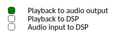
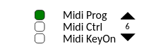
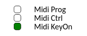

# FilDeSoi
Fil de soi is a mixed piece for acoustic and electronic guitar in real time. Composed by Alain Bonardi and performed by Amèlia Mazarico.
Created the 17th september 2016.

Inscore allow this score to embed the audio DSP of the composition and connect the different inputs to this DSP.

## Audio connections configuration
In The bottom right corner, the user can configure which input is connected to what output. The Three modes can be activated together:
- Wav audio to audio Output will connect the wav audio to the Output.
- Wav audio to DSP will connect the wav audio to the DSP.
- Audio In to DSP will record the microphone of the user (asked permission at the start of the page) and inject it to the DSP.
In any case the DSP is connected to audio Output.

 

## Midi Support
This score supports midi inputs.
In the bottom left corner the user will find a control panel allowing him to choose which midi event type will be watched :
- KeyOn
- Program Change
- Control Change

The action triggered by the midi inputs always switch to the next faust DSP section.
User can choose program key or control key for control and program change, there is no input for now but the user can user the scroll arrows to select his prefered midi controller number.

 


## Remote control with fildesoi.inscore (native version)
Fil de soi is packaged with his native version destined to remote control the score.
The native score forwards messages to clients score acting like a server.

Clients can connect to a native score allowing control to the native score over the client version (index.html)
The native score is only used for remote control and do not load the faust DSP.
Once the native score is loaded all clients can connect to the host, from this moment, the host will send messages to the clients.


## Details
- `index.html` : Score Client web, a faust DSP is embeded.
- `fildesoi.inscore` : Native Score, it'll controls clients by sending message to them.
- `packages.json` : Package definition for installation.
- `rsrc/` : All usefull ressources (audio, images).
- `src/` : All inscore addons loaded and needed for fildesoi.
- `faust.json` & `faust.wasm` faust dsp loaded with fautsw (the loading must be faster than with faustf).

## Installation
clone the repository then
```
cd fildesoi && npm install
```

## Local test
```
python -m http.server <port>
```
Then you can visit `localhost:<port>` in your prefered navigator (firefox, chrome). 

## InscoreWeb
The INScoreJS library allows to embed the [INScore](https://inscore.grame.fr) engine services in a web page and to design augmented, dynamic and interactive musical scores that can be published on the Internet.

## Faust
[Faust](https://faust.grame.fr/) (Functional Audio Stream) is a functional programming language for sound synthesis and audio processing with a strong focus on the design of synthesizers, musical instruments, audio effects, etc. Faust targets high-performance signal processing applications and audio plug-ins for a variety of platforms and standards.

With INScore we can embeded a Faust DSP allowing real time signal processing inside the augmented score.